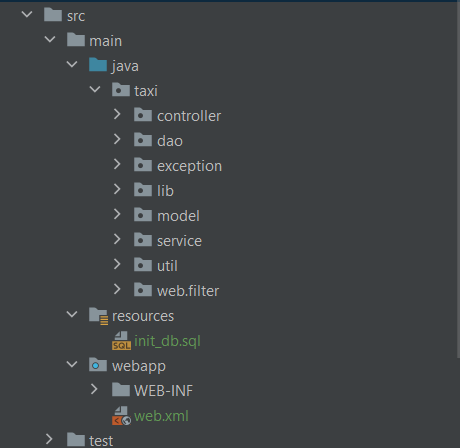

# 🚕 Taxi-service 🚕

## Project description

A simple web-application that supports authentication, registration and other CRUD operations using MySQL as a database, 
JAVA Servlets, Dependency Injection principle and N-tier architecture.
## 🎯 Features

+ registration like a driver
+ authentication like a driver
+ create/remove a manufacturer
+ create/remove a driver
+ create/remove a car
+ display list of all manufacturers
+ display list of all drivers
+ display list of all cars
+ display all cars by logged-in driver

## Project structure

The model level is represented in the following diagram:

## 💻 Technologies:

- JAVA 11 or higher
- Maven 3
- JAVA Servlet(v.4.x.x), Filter 
- JSP, JSTL(v.1.2)
- Tomcat v.9.x.x
- JDBC
- MySQL v.8.x.x

## Installation

- Install [MySQL](https://dev.mysql.com/doc/mysql-installation-excerpt/5.7/en/);
- Create your own schema and tables using [init_db.sql](resources/init_db.sql) file;
- Install [Apache Tomcat v.9.x.x](https://tomcat.apache.org/download-90.cgi) ;
- Clone this project from GitHub;
- Change URL, username, password and JDBC driver in taxi-service-servlets\src\main\java\taxi\util\ConnectionUtil.java;
- Configure Tomcat server:
  1. Edit configuration;
  2. Tomcat Server -> Local
  3. Deployment -> add -> artifact -> taxi-service:war exploded
  4. Application context : /
  5. Press apply -> okay.
    